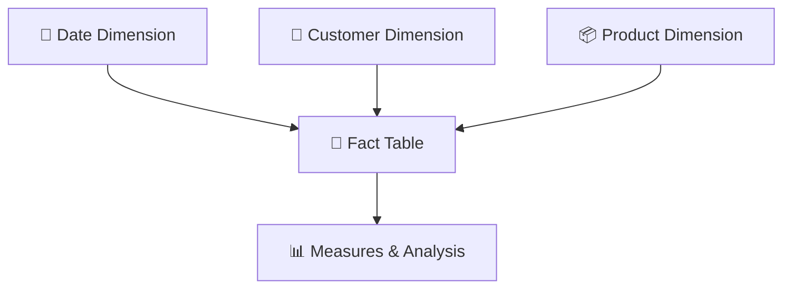

# Power BI Data Analysis & Visualisation Project – Data Technician Bootcamp

In this repository, I showcase the Power BI reports, exercises and supporting materials I completed during the **Week 2 Power BI module of the Data Technician Bootcamp**.

## 📊 Project Overview

During this project, I used **Microsoft Power BI** to prepare, model, analyse and visualise structured data.

I worked through the complete Power BI workflow — from importing and cleaning data with **Power Query**, through data modelling and DAX calculations, to designing interactive reports and publishing completed work through **Power BI Service**.

## 🔄 My Power BI Workflow


## 🛠️ Skills I Demonstrated

### 🧹 Data Cleaning & Transformation

Using **Power Query**, I:

* Imported datasets
* Cleaned raw information
* Changed data types
* Transformed columns
* Prepared data for analysis
* Loaded transformed data into Power BI

### 🔗 Data Modelling

I developed an understanding of:

* Fact tables
* Dimension tables
* Table relationships
* Semantic models
* Structuring data for analysis

### 🧮 DAX

I used **Data Analysis Expressions (DAX)** to create:

* Calculated columns
* Measures
* Business metrics
* Reusable analytical calculations

### 🎛️ Interactive Reporting

I worked with:

* Filters
* Slicers
* Interactive visualisations
* Dynamic report exploration
* Report formatting

### 📊 Data Visualisation

I created visualisations including:

* 📊 Bar charts
* 📈 Line charts
* 🥧 Pie charts
* 🗺️ Maps
* 🔢 Card visuals
* 💬 Q&A visuals

## 📈 Key Project Activities

### 🧹 Data Transformation with Power Query

I used **Power Query** to clean and transform datasets before beginning my analysis.

This taught me the importance of ensuring data is correctly structured, formatted and prepared before creating calculations or reports.

### 🔗 Data Modelling

I explored relationships between **fact and dimension tables** and learned how these relationships support structured analytical models.



### 🧮 DAX Calculations

I created DAX calculations to produce metrics that could be reused throughout my reports.

This helped me understand the difference between displaying raw data and creating analytical measures that provide additional business context.

### 📊 Interactive Report Development

I designed Power BI reports containing multiple visualisations so users could investigate:

* Trends
* Performance differences
* Category comparisons
* Key metrics

I used filters and slicers to make the reports interactive rather than static.

### ☁️ Publishing to Power BI Service

I published completed reports to **Power BI Service**, giving me experience with the full workflow from report development in Power BI Desktop to online publishing and sharing.

## 📖 Data Storytelling

Through this project, I learned how Power BI combines:

**Data preparation + modelling + calculations + visualisation**

to create reports that communicate information effectively.


Rather than simply displaying individual charts, I focused on using reports to help users understand patterns, trends and important metrics.

## 🎯 Learning Outcomes

By completing this project, I developed practical experience in:

* Power BI Desktop
* Power Query
* Data cleaning
* Data transformation
* Data modelling
* Fact and dimension tables
* DAX
* Calculated columns
* Measures
* Filters
* Slicers
* Interactive reports
* Data visualisation
* Power BI Service

## 💻 Tools I Used

`Microsoft Power BI` `Power Query` `DAX` `Power BI Service` `Data Modelling` `Interactive Reports` `Data Visualisation`

## 📁 Project Contents

```text
📦 Power-BI-Project
 ┣ 📊 Power BI reports
 ┣ 🧹 Power Query exercises
 ┣ 🧮 DAX exercises
 ┣ 🔗 Data modelling exercises
 ┣ 🖼️ Report screenshots
 ┣ 📁 Supporting datasets
 ┗ 📄 README.md
```
